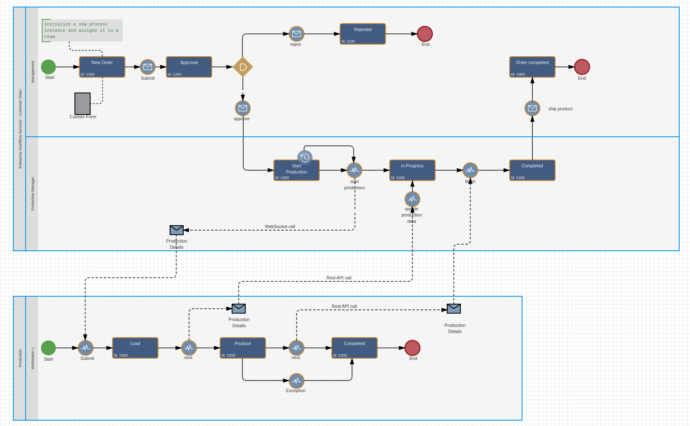

# Imixs-Micro

Imixs Micro is a lightweight distributed workflow management system based on the [Imixs-Workflow](https://www.imixs.org) technology. 
This system can be used, for example, as a workflow service in an industrial production plant. 

## Architecture Overview

This repository contains the architecture and implementation details for a distributed workflow management system designed for industrial applications. The system consists of an enterprise-process-management layer and multiple micro-process-management layers used in production workstations. The messaging between the different services is  utilizing a combination of WebSocket communication and REST APIs for efficient and scalable operations.

### Key Components

1. **Enterprise-Process Server**
   - Runs Imixs-Workflow engine on a Jakarta EE server
   - Manages high-level processes (e.g., customer orders)
   - Communicates with workstations via WebSockets and REST

2. **Micro-Process Workstations**
   - Raspberry Pi-based interfaces for production equipment
   - Running lightweight  Imixs-Workflow Micro Kernel for local process management
   - Communicate with Enterprise-Process server and other workstations

## Communication Patterns

The goal of the messaging between the Enterprise-Process Server and the Workstations is bi-directional messaging pattern. To start a new production processes  on dedicated  workstation based on the model definition, the  Enterprise-Process Server opens a WebSocket connection to the workstation. To signal the completion of a production process the workstation sends a Message via Rest API to the Enterprise-Process service. Furthermore a Workstation can start processes on other Workstations in Bidirectional message flow based on WebSockets only. 

### Enterprise-Process → Workstation

- **Direction**: Unidirectional (Enterprise-Process → Workstation )
- **Technology**: WebSockets
- **Purpose**: Rapid distribution of production orders
- **Implementation**: Quarkus with jakarta.websocket API

### Workstation → Enterprise-Process
- **Direction**: Unidirectional (Workstation → Enterprise-Process)
- **Technology**: REST API
- **Purpose**: Status updates and process completion notifications
- **Implementation**: Utilizing existing Imixs-Workflow REST API

### Workstation → Workstation
- **Direction**: Bidirectional
- **Technology**: WebSockets
- **Purpose**: Fast, real-time communication for short-lived sub-processes
- **Implementation**: Quarkus with jakarta.websocket API

## Implementation Details

### Enterprise-Process Server (Jakarta EE)
1. **WebSocket Client**
   - Implemented using jakarta.websocket API
   - Sends production orders to workstations

2. **REST API Endpoints**
   - Existing Imixs-Workflow REST API
   - Receives status updates and process completion notifications from workstations

### Workstation (Raspberry Pi with Quarkus)
1. **WebSocket Server**
   - Implemented using jakarta.websocket API via Quarkus
   - Receives production orders from Enterprise-Process server

2. **WebSocket Client and Server**
   - For workstation-to-workstation communication
   - Implemented using jakarta.websocket API via Quarkus

3. **REST Client**
   - Implements calls to Imixs-Workflow REST API on Enterprise-Process server
   - Sends status updates and process completion notifications

### Key Advantages
1. **Efficiency**: Fast distribution of production orders via WebSockets
2. **Simplicity**: Streamlined implementation on resource-constrained workstations
3. **Scalability**: Efficient handling of multiple workstations
4. **Flexibility**: Tailored communication patterns for different interaction types

### Implementation Considerations
1. **Error Handling**: Robust mechanisms for WebSocket connection failures
2. **Connection Management**: Auto-reconnect for WebSocket connections on workstations
3. **Security**: Proper authentication and authorization for all communication channels

